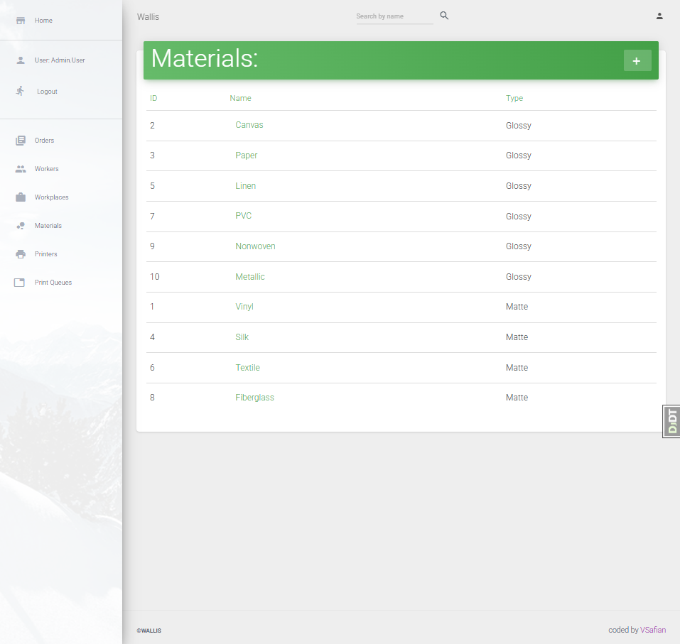
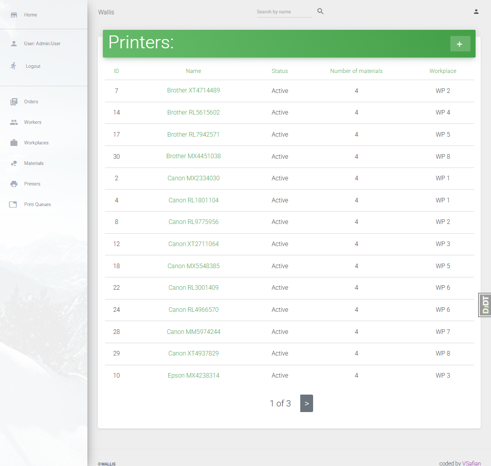
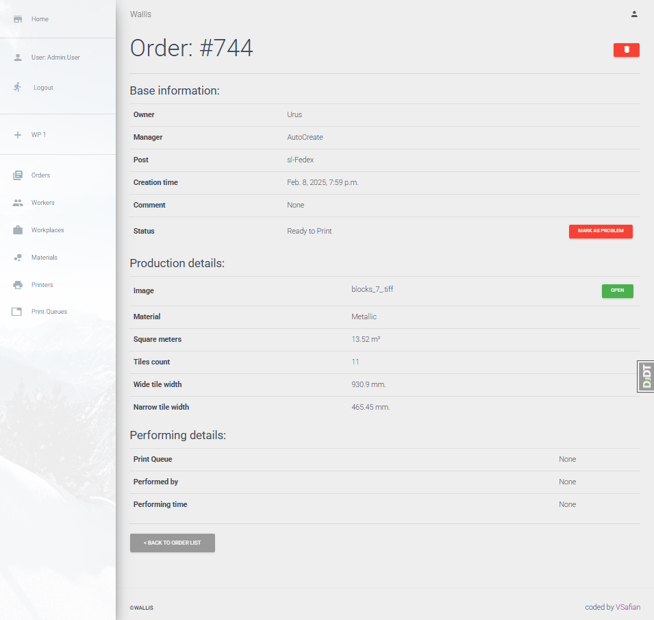

# Wallis - Print Queue Management System

## 📌 Project Description
**Wallis** is a Django-based project designed to automate and streamline the creation of print queues, order selection, and related operations. 

## 🎯 Why This Project?
During my previous work, I encountered a lot of manual paperwork related to order calculations, material matching, and print queue building. To simplify these processes, I developed **Wallis**, which serves as both a practical Django project and an automation tool.

## 📂 Project Structure
Wallis follows an **MVC (Model-View-Controller) pattern**, with the following core models:

### 📌 Models Overview:
- **Worker** – Represents employees handling orders.
- **Printer** – Stores information about available printing devices.
- **Order** – Manages customer orders, including dimensions and material.
- **Material** – Defines available printing materials.
- **PrintQueue** – Organizes orders into print queues.
- **Workplace** – Represents different working stations with assigned printers.

### 📊 Database Schema:

---

## ⚡ Features
Wallis aims to replicate real-world printing workflow as closely as possible.

### 📈 Real time statistic:
- **Track leaderboard** for daily closed orders.
- **Track productivity for week**.
  

### ✔️ CRUD Operations:
- **Create, Update, Delete** print queues and orders.
- **Real-time calculations** and **order filtering** in forms.
- **Dynamic backend-driven UI** for an improved user experience.

### 📌 Print Queue Management:
- **Creating a print queue**:
  
  
- **Updating an existing queue**:
  

### 🛠️ Tech Stack
- **Django 4.x – Backend framework**
- **SQLite3 – Database**
- **Bootstrap 5 – Frontend styling**
- **Chartist.js – Data visualization**
- **Django Filters – Advanced filtering**
---

## 🚀 Installation Guide

### 1️⃣ Setup & Migrations
Clone the repository and run the following commands:

`git clone https://github.com/vsafian/wallis.git`
`cd wallis`
`python -m venv venv`
`source venv/bin/activate`  # On Windows use: `venv\Scripts\activate`
`pip install -r requirements.txt`
`python manage.py makemigrations`
`python manage.py migrate`

### 2️⃣ Load Sample Data
The project provides fixtures to pre-load test data.

`python manage.py loaddata fixtures/<fixture name>.json`
Available fixtures:

materials.json
orders.json
printers.json
workers.json
workplaces.json
superuser.json

(!) Important: Load superuser.json first if you want to use pre-configured admin credentials and correct load workers fixture.

The recommended order of fixture loading:
1. workplaces.json
2. materials.json
3. printers.json
4. orders.json
5. superuser.json
6. workers.json

🔑 Superuser Credentials:
* Username: `admin.user`
* Password: `1qazcde3`

---

## Overview
### Login page:
A simple login interface where users can authenticate using their credentials.

### Worker pages:

(!) Note: The deletion pages share a similar layout with the primary difference being the displayed name.
---
### Material pages:

---
### Printer pages:

---
### Workplace pages:

#### Workplace Create/Update
  - The relationship between workers and workplaces is managed via a foreign key, similar to printers.
  - By default, the form permits editing only the workplace name.
  - For proper operation, additional fields for printers and workers have been included, with customized querysets.
  - When creating a new workplace, only unassigned (free) printers and workers are displayed. When editing, both the assigned and available options are visible.

---

#### Order pages:

#### Order Create/Update
- The Order does not have the functionality of creating and updating.

---

### Print Queue pages:

#### Print Queue Create/Update
  - The process begins on the workplace page, simplifying the selection of an initial workplace.
  - The form includes an additional field for orders.
  - The Material and Order fields have an onchange property that dynamically reloads the queryset based on the selection.
  - Although an AJAX-based solution was considered, dynamic updates were implemented on the backend due to limited proficiency in JavaScript.
  - The form features real-time calculations and warning messages, implemented via a dedicated calculations module and an included summary template.

  - **Creation Specifics:**  
    - Only orders that are ready to print are included.
    - The workplace field is disabled.  
    - Orders are initially filtered by the available printers and their associated materials; upon selecting a material, the orders are further filtered.
  

  - **Update Specifics:**  
    - The material field is disabled.
    - Only the selected and ready orders are shown, filtered by the initial material.
    - Workplaces are also filtered based on the initial material, provided a printer in that workplace is available.
  
 
  

---

### Print Queue and Order Stats
- Both the Order and Print Queue models inherit from PrintStatusMixin.
- In the system, a worker can only set either the 'problem' or 'ready to print' status for both models.
- Therefore, if an order is editable (i.e., its status is either 'ready to print' or 'problem'), the worker can change it.
- A worker cannot change the print queue status directly. For example, if there is a print queue (with status 'ready to print') containing three orders that are all ready, and the worker sets one order's status to 'problem', the print queue status will automatically change from 'ready to print' to 'problem'.
- Conversely, if a print queue contains orders with a 'problem' status, its status will change from 'problem' to 'ready to print' when the number of problem orders becomes exactly one and the worker changes that order.
- The system allows removing problematic orders directly during the queue editing process, reducing the need to navigate through multiple pages. As a result, only fully validated orders proceed to printing, streamlining the workflow and minimizing downtime.

---

## TODO / Future Improvements

- Improving the integration of search and filtering functionality:
  - Currently, a custom `ListViewSearchMixin` is used to implement search, and a separate `django_filters.FilterSet` is used for filtering.  
  - It is planned to optimize the integration of these approaches to avoid code duplication and provide more consistent work with search queries and data filtering.

- Adding a comment model for describing errors:
  - In the future, we are considering adding a separate comment model that will allow users to describe errors and problems encountered while working with the system.
  - This will facilitate a more detailed analysis of problems and their faster resolution.

- Other improvements:
  - Expanding testing and optimizing existing features.
  - Development of additional documentation for API and integration with other systems.